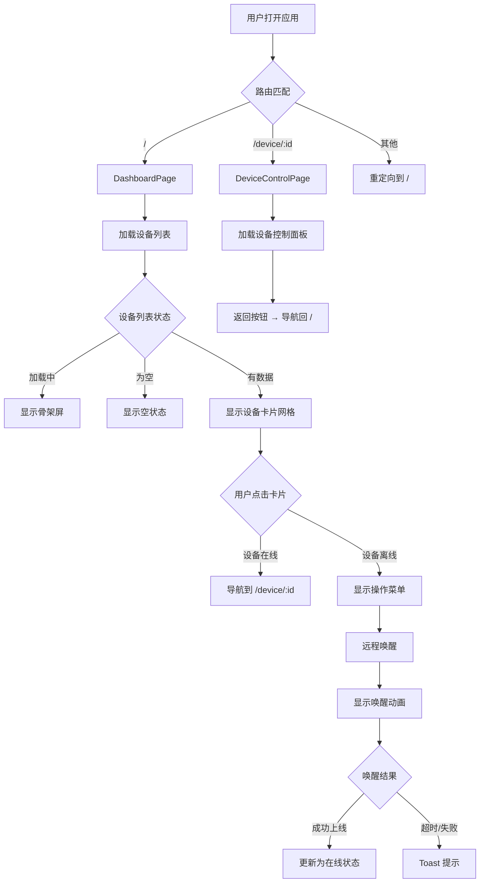
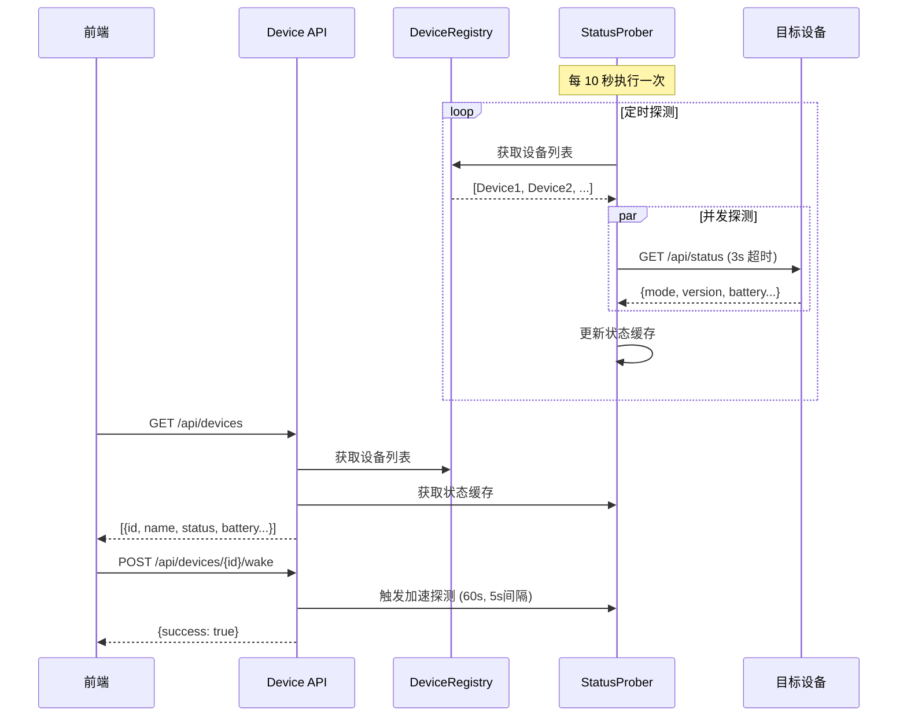

# Design Document: Device Home Dashboard

## Overview

本设计为小橙项目引入「设备管理主页（Device Home Dashboard）」，在现有控制面板之前增加一个类似蔚来/小鹏汽车 App 风格的设备管理首页。用户打开前端后首先看到设备卡片列表，可查看在线状态、电量等关键指标，执行远程唤醒（WOL），并选择进入某台设备的专属控制面板。

### 设计目标

1. **前端优先**：前端组件可独立开发，后端 API 先用 mock 数据
2. **科技风 UI**：深黑背景 + 青蓝发光线条 + 毛玻璃卡片 + 大号数字指标
3. **最小侵入**：现有控制面板代码封装为路由子页面，核心逻辑不变
4. **可扩展**：设备注册表 + 状态探测架构支持未来多设备管理

### 关键技术决策

| 决策 | 选择 | 理由 |
|---|---|---|
| 前端路由 | Vue Router 4 | Vue 3 生态标配，支持动态路由和导航守卫 |
| 设备注册表存储 | JSON 文件 | 轻量、无需数据库，适合嵌入式场景（设备数量 < 20） |
| 状态探测方式 | HTTP 轮询 `/api/status` | 复用现有端点，无需额外协议 |
| WOL 实现 | Python `socket` 原生 UDP 广播 | 无外部依赖，魔术包协议简单 |
| 前端状态轮询 | `setInterval` + fetch | 设备列表低频更新（10s），无需 WebSocket |
| UI 风格 | 科技风深色主题 | 用户指定，参考蔚来/小鹏 App 视觉语言 |

---

## Architecture

### 整体架构

本功能在现有六层架构基础上扩展，不改变核心通信模式：

```
┌─────────────────────────────────────────────────────┐
│                    前端层 (Vue 3)                      │
│  ┌──────────┐    ┌──────────────┐    ┌────────────┐  │
│  │ Dashboard │    │ DeviceCard   │    │ControlPanel│  │
│  │  Page     │◄──►│ Components   │    │ (现有面板)  │  │
│  └─────┬────┘    └──────────────┘    └─────┬──────┘  │
│        │              ▲                     │         │
│        ▼              │                     ▼         │
│  ┌──────────┐    ┌────┴─────┐    ┌──────────────┐    │
│  │deviceStore│    │ Vue      │    │  carStore    │    │
│  │ (Pinia)  │    │ Router   │    │  (现有)      │    │
│  └─────┬────┘    └──────────┘    └──────────────┘    │
│        │ HTTP 轮询                  │ WebSocket       │
├────────┼────────────────────────────┼────────────────┤
│        ▼           接口层            ▼                │
│  ┌──────────────┐           ┌──────────────┐         │
│  │ device API   │           │ ws/control   │         │
│  │ (FastAPI)    │           │ (现有)       │         │
│  └─────┬────────┘           └──────────────┘         │
│        │                                              │
├────────┼──────────── 业务层 ─────────────────────────┤
│  ┌─────┴────────┐    ┌──────────────┐                │
│  │DeviceRegistry│    │StatusProber  │                │
│  │ (注册表)     │◄──►│ (状态探测)   │                │
│  └─────┬────────┘    └──────┬───────┘                │
│        │                     │                        │
│  ┌─────┴────────┐    ┌──────┴───────┐                │
│  │ WOLService   │    │ HTTP Client  │                │
│  │ (远程唤醒)   │    │ (httpx/aiohttp)│              │
│  └──────────────┘    └──────────────┘                │
└─────────────────────────────────────────────────────┘
```

### 前端路由结构

```
/                    → DashboardPage (设备列表首页)
/device/:id          → DeviceControlPage (设备控制面板)
/device/xiaocheng    → 现有 App.vue 内容封装
/*                   → 重定向到 /
```

### 前端组件树

```
App.vue (路由容器)
├── router-view
│   ├── DashboardPage.vue
│   │   ├── DashboardHeader.vue (标题栏 + 设备数量)
│   │   ├── DeviceGrid.vue (网格容器)
│   │   │   ├── DeviceCard.vue × N (设备卡片)
│   │   │   │   ├── DeviceStatusDot.vue (在线/离线指示)
│   │   │   │   ├── BatteryIndicator.vue (电量显示)
│   │   │   │   └── WakeButton.vue (唤醒按钮)
│   │   │   └── DeviceCardSkeleton.vue (加载骨架屏)
│   │   └── EmptyState.vue (空状态提示)
│   └── DeviceControlPage.vue
│       ├── ControlPageHeader.vue (返回按钮 + 设备名)
│       └── XiaoChengPanel.vue (现有控制面板内容)
```

### 后端模块结构

```
app/
├── device/                    # 新增设备管理模块
│   ├── __init__.py
│   ├── registry.py            # DeviceRegistry: 设备注册表
│   ├── prober.py              # StatusProber: 状态探测
│   ├── wol.py                 # WOLService: Wake-on-LAN
│   └── models.py              # Pydantic 数据模型
├── api/
│   ├── device.py              # 新增: 设备管理 HTTP API
│   └── ... (现有文件不变)
└── data/
    └── devices.json           # 设备注册表持久化文件
```

---

## Components and Interfaces

### 前端组件

#### 1. DashboardPage.vue

主页面容器，负责组装 Header、DeviceGrid 和 EmptyState。

```typescript
// Props: 无
// Emits: 无
// 依赖: useDeviceStore(), useRouter()

interface DashboardPageState {
  isLoading: boolean
}
```

#### 2. DeviceCard.vue

单个设备卡片，展示设备信息和交互入口。

```typescript
interface DeviceCardProps {
  device: Device
}

interface DeviceCardEmits {
  click: [deviceId: string]
  wake: [deviceId: string]
}
```

科技风视觉规范：
- 卡片背景：`rgba(14, 17, 24, 0.85)` + `backdrop-filter: blur(16px)`
- 边框：`1px solid rgba(0, 212, 255, 0.12)` (离线时降低到 0.06)
- 在线状态发光：`box-shadow: 0 0 20px rgba(0, 212, 255, 0.08)`
- 离线卡片：`opacity: 0.55`
- 悬停效果：边框亮度提升 + 微弱上移 `transform: translateY(-2px)`

#### 3. DashboardHeader.vue

顶部标题栏，展示应用名称和设备统计。

```typescript
interface DashboardHeaderProps {
  deviceCount: number
  onlineCount: number
}
```

#### 4. BatteryIndicator.vue

电量指示器，大号数字 + 环形进度。

```typescript
interface BatteryIndicatorProps {
  percent: number
  voltage: number
  level: 'ok' | 'low' | 'critical' | 'unknown'
}
```

#### 5. DeviceCardSkeleton.vue

加载骨架屏，模拟卡片布局的占位动画。

#### 6. EmptyState.vue

空状态提示，引导用户添加设备。

#### 7. WakeButton.vue

唤醒按钮，带脉冲动画状态。

```typescript
interface WakeButtonProps {
  status: 'idle' | 'waking' | 'success' | 'failed'
  supportsWol: boolean
}

interface WakeButtonEmits {
  wake: []
}
```

### 前端 Store

#### deviceStore.ts

```typescript
interface Device {
  id: string
  name: string
  type: string           // 'xiaocheng' | 'camera' | 'sensor' | 'generic'
  ip: string
  mac: string | null
  icon: string           // 图标标识
  status: 'online' | 'offline' | 'waking'
  battery_percent: number | null
  battery_voltage: number | null
  battery_level: string | null
  last_seen: string | null
}

interface DeviceStore {
  // State
  devices: Device[]
  isLoading: boolean
  lastFetchTime: number | null

  // Actions
  fetchDevices(): Promise<void>
  wakeDevice(id: string): Promise<boolean>
  startPolling(): void
  stopPolling(): void
}
```

### 前端 Composable

#### useDeviceApi.ts

封装设备管理 HTTP API 调用，支持 mock 模式。

```typescript
interface UseDeviceApi {
  fetchDevices(): Promise<Device[]>
  wakeDevice(id: string): Promise<{ success: boolean; message: string }>
  addDevice(data: CreateDeviceRequest): Promise<Device>
  deleteDevice(id: string): Promise<void>
}
```

### 后端组件

#### 1. DeviceRegistry (app/device/registry.py)

```python
class DeviceRegistry:
    """设备注册表：加载、查询、增删设备"""

    def __init__(self, config_path: str = "app/data/devices.json"):
        self._config_path = config_path
        self._devices: dict[str, DeviceRecord] = {}

    def load(self) -> None: ...
    def save(self) -> None: ...
    def list_all(self) -> list[DeviceRecord]: ...
    def get(self, device_id: str) -> DeviceRecord | None: ...
    def add(self, device: CreateDeviceRequest) -> DeviceRecord: ...
    def remove(self, device_id: str) -> bool: ...
```

#### 2. StatusProber (app/device/prober.py)

```python
class StatusProber:
    """状态探测器：定时轮询设备可达性"""

    def __init__(self, registry: DeviceRegistry, interval: float = 10.0):
        self._registry = registry
        self._interval = interval
        self._status_cache: dict[str, DeviceStatus] = {}
        self._running = False

    async def start(self) -> None: ...
    async def stop(self) -> None: ...
    async def probe_device(self, device: DeviceRecord) -> DeviceStatus: ...
    async def accelerated_probe(self, device_id: str, duration: float = 60.0, interval: float = 5.0) -> None: ...
    def get_status(self, device_id: str) -> DeviceStatus | None: ...
    def get_all_statuses(self) -> dict[str, DeviceStatus]: ...
```

#### 3. WOLService (app/device/wol.py)

```python
class WOLService:
    """Wake-on-LAN 服务：发送魔术包"""

    @staticmethod
    def build_magic_packet(mac: str) -> bytes: ...
    @staticmethod
    async def send_wol(mac: str, broadcast: str = "255.255.255.255", port: int = 9) -> bool: ...
```

#### 4. Device HTTP API (app/api/device.py)

```python
router = APIRouter(prefix="/api/devices", tags=["devices"])

@router.get("/")
async def list_devices() -> list[DeviceResponse]: ...

@router.post("/")
async def add_device(req: CreateDeviceRequest) -> DeviceResponse: ...

@router.delete("/{device_id}")
async def delete_device(device_id: str) -> dict: ...

@router.post("/{device_id}/wake")
async def wake_device(device_id: str) -> WakeResponse: ...
```

---

## Data Models

### 后端 Pydantic 模型

```python
from pydantic import BaseModel, Field
from enum import Enum
import uuid

class DeviceType(str, Enum):
    XIAOCHENG = "xiaocheng"
    CAMERA = "camera"
    SENSOR = "sensor"
    GENERIC = "generic"

class DeviceRecord(BaseModel):
    """设备注册表记录（持久化）"""
    id: str = Field(default_factory=lambda: str(uuid.uuid4()))
    name: str
    type: DeviceType
    ip: str
    mac: str | None = None
    icon: str = "default"

class DeviceStatus(BaseModel):
    """设备实时状态（内存缓存）"""
    online: bool = False
    battery_percent: int | None = None
    battery_voltage: float | None = None
    battery_level: str | None = None
    last_seen: str | None = None       # ISO 8601 时间戳
    last_probe_time: str | None = None

class DeviceResponse(BaseModel):
    """API 返回的完整设备信息（注册信息 + 实时状态）"""
    id: str
    name: str
    type: DeviceType
    ip: str
    mac: str | None
    icon: str
    status: str          # "online" | "offline"
    battery_percent: int | None
    battery_voltage: float | None
    battery_level: str | None
    last_seen: str | None

class CreateDeviceRequest(BaseModel):
    """添加设备请求"""
    name: str = Field(min_length=1, max_length=50)
    type: DeviceType = DeviceType.GENERIC
    ip: str = Field(min_length=7)   # 最短合法 IP: "1.1.1.1"
    mac: str | None = None
    icon: str = "default"

class WakeResponse(BaseModel):
    """唤醒响应"""
    success: bool
    message: str
    device_id: str
```

### JSON 配置文件格式 (devices.json)

```json
{
  "devices": [
    {
      "id": "xiaocheng-default-001",
      "name": "小橙",
      "type": "xiaocheng",
      "ip": "192.168.0.110",
      "mac": null,
      "icon": "xiaocheng"
    }
  ]
}
```

### 前端 TypeScript 类型

```typescript
interface Device {
  id: string
  name: string
  type: 'xiaocheng' | 'camera' | 'sensor' | 'generic'
  ip: string
  mac: string | null
  icon: string
  status: 'online' | 'offline' | 'waking'
  battery_percent: number | null
  battery_voltage: number | null
  battery_level: 'ok' | 'low' | 'critical' | 'unknown' | null
  last_seen: string | null
}

interface CreateDeviceRequest {
  name: string
  type: string
  ip: string
  mac?: string
  icon?: string
}

interface WakeResponse {
  success: boolean
  message: string
  device_id: string
}
```

### 科技风 UI 设计规范

#### 色彩系统

```css
:root {
  /* 背景层级 */
  --bg-base: #0a0c10;           /* 最深背景 */
  --bg-surface: #0d0f14;        /* 页面背景 */
  --bg-card: rgba(14, 17, 24, 0.85);  /* 卡片背景 */
  --bg-elevated: rgba(20, 24, 32, 0.9); /* 弹出层背景 */

  /* 品牌色 (橙色) */
  --brand: #e8842c;
  --brand-dim: rgba(232, 132, 44, 0.15);
  --brand-glow: rgba(232, 132, 44, 0.3);

  /* 科技辅助色 (青蓝) */
  --tech-cyan: #00d4ff;
  --tech-cyan-dim: rgba(0, 212, 255, 0.12);
  --tech-cyan-glow: rgba(0, 212, 255, 0.2);
  --tech-blue: #0ea5e9;

  /* 状态色 */
  --status-online: #2dd284;
  --status-offline: #555860;
  --status-waking: #00d4ff;
  --status-error: #e24b4a;
  --status-warning: #f5a623;

  /* 文字 */
  --text-primary: #e8e6e1;
  --text-secondary: #8a8d95;
  --text-muted: #555860;

  /* 边框 */
  --border-subtle: rgba(255, 255, 255, 0.06);
  --border-default: rgba(255, 255, 255, 0.12);
  --border-cyan: rgba(0, 212, 255, 0.15);
}
```

#### 卡片视觉规范

```
┌─────────────────────────────────┐
│  ┌─────┐                        │
│  │ 图标 │  设备名称        ● 在线 │
│  │(发光)│  设备类型              │
│  └─────┘                        │
│                                  │
│     ╭──────╮                     │
│     │  78  │  ← 大号电量数字     │
│     │  %   │     (JetBrains Mono)│
│     ╰──────╯                     │
│   7.95V        ← 电压副指标      │
│                                  │
│  ┌──────────────────────────┐   │
│  │      进入控制 →          │   │
│  └──────────────────────────┘   │
└─────────────────────────────────┘

卡片样式:
- background: var(--bg-card)
- backdrop-filter: blur(16px)
- border: 1px solid var(--border-cyan)
- border-radius: 16px
- 在线时: box-shadow: 0 0 20px rgba(0, 212, 255, 0.08),
                       inset 0 1px 0 rgba(255, 255, 255, 0.05)
- 离线时: opacity: 0.55, border-color: var(--border-subtle)
```

#### 图标按钮规范

```
圆形图标按钮 (类似蔚来 App 的解锁/空调按钮):
- width/height: 56px
- border-radius: 50%
- background: rgba(0, 212, 255, 0.08)
- border: 1.5px solid rgba(0, 212, 255, 0.25)
- 悬停: border-color 提升, box-shadow 发光
- 激活: background 加深, 发光增强
- 图标: 24px, stroke: var(--tech-cyan)
```

#### 大号数字指标

```
电量百分比:
- font-family: 'JetBrains Mono', monospace
- font-size: 36px
- font-weight: 700
- color: var(--tech-cyan)
- text-shadow: 0 0 20px rgba(0, 212, 255, 0.3)

电压副指标:
- font-size: 14px
- color: var(--text-secondary)
```

#### 动画规范

```css
/* 唤醒脉冲动画 */
@keyframes wake-pulse {
  0%, 100% { box-shadow: 0 0 0 0 rgba(0, 212, 255, 0.4); }
  50% { box-shadow: 0 0 0 12px rgba(0, 212, 255, 0); }
}

/* 在线状态呼吸灯 */
@keyframes status-breathe {
  0%, 100% { opacity: 1; }
  50% { opacity: 0.5; }
}

/* 骨架屏闪烁 */
@keyframes skeleton-shimmer {
  0% { background-position: -200% 0; }
  100% { background-position: 200% 0; }
}

/* 卡片入场 */
@keyframes card-enter {
  from { opacity: 0; transform: translateY(16px); }
  to { opacity: 1; transform: translateY(0); }
}
```

### Mermaid 架构图

#### 前端路由流程



#### 后端状态探测流程



---

## Correctness Properties

*A property is a characteristic or behavior that should hold true across all valid executions of a system — essentially, a formal statement about what the system should do. Properties serve as the bridge between human-readable specifications and machine-verifiable correctness guarantees.*

### Property 1: Device record serialization round-trip

*For any* valid DeviceRecord (with arbitrary name, type, IP, MAC, icon), serializing to JSON and deserializing back should produce an equivalent DeviceRecord with all fields preserved.

**Validates: Requirements 1.1**

### Property 2: Device IDs are unique and UUID-formatted

*For any* batch of N device creation requests (N ≥ 1), all assigned device IDs should be unique across the batch and each ID should match the UUID format pattern.

**Validates: Requirements 1.4**

### Property 3: Device creation input validation

*For any* CreateDeviceRequest, if the request has a non-empty name and a valid IP address (length ≥ 7), the registry should accept it and return a valid DeviceRecord; if any required field is missing or invalid, the registry should reject it with a validation error.

**Validates: Requirements 1.5, 8.5**

### Property 4: Delete preserves other devices

*For any* registry containing N devices (N ≥ 2), deleting one device by ID should result in exactly N-1 devices remaining, and all non-deleted devices should be unchanged.

**Validates: Requirements 1.6**

### Property 5: WOL magic packet structure

*For any* valid MAC address (6 octets), the constructed magic packet should be exactly 102 bytes: 6 bytes of 0xFF followed by 16 repetitions of the 6-byte MAC address.

**Validates: Requirements 3.1**

### Property 6: Status response battery data extraction

*For any* valid `/api/status` response containing battery_percent (0-100) and battery_voltage (0.0-12.0), the StatusProber should extract and cache these values exactly as provided in the response.

**Validates: Requirements 2.5**

---

## Error Handling

### 后端错误处理

| 场景 | 处理方式 | HTTP 状态码 |
|---|---|---|
| 配置文件不存在 | 创建默认配置（含小橙） | N/A (启动时) |
| 配置文件 JSON 格式无效 | 记录错误日志，回退默认配置 | N/A (启动时) |
| 添加设备缺少必填字段 | 返回验证错误详情 | 422 |
| 删除/查询不存在的设备 | 返回 Not Found | 404 |
| WOL 设备无 MAC 地址 | 返回错误说明不支持 WOL | 400 |
| WOL 网络发送失败 | 返回失败原因 | 500 |
| 状态探测超时 (3s) | 标记设备离线 | N/A (内部) |
| 状态探测网络异常 | 标记设备离线，记录日志 | N/A (内部) |
| 配置文件写入失败 | 记录错误日志，内存状态保持 | 500 |

### 前端错误处理

| 场景 | 处理方式 |
|---|---|
| 设备列表 API 请求失败 | 保留上次数据，下个周期重试 |
| 唤醒请求失败 | Toast 提示失败原因，恢复卡片状态 |
| 唤醒超时（60s 内未上线） | 自动取消唤醒动画，恢复离线状态 |
| 路由到不存在的设备 | 重定向到 Dashboard |
| 网络断开 | 停止轮询，显示离线提示 |

---

## Testing Strategy

### 测试框架选择

| 层级 | 框架 | 说明 |
|---|---|---|
| 后端单元测试 | pytest | 项目已有 pytest 配置 |
| 后端属性测试 | pytest + hypothesis | Python 生态最成熟的 PBT 库 |
| 后端集成测试 | pytest + httpx (TestClient) | FastAPI 官方推荐 |
| 前端单元测试 | vitest + @vue/test-utils | Vite 生态标配 |
| 前端 E2E | 手动测试 | 设备数量少，E2E 自动化 ROI 低 |

### 属性测试 (Property-Based Testing)

使用 Hypothesis 库实现，每个属性测试最少 100 次迭代。

**测试文件**: `tests/test_device_properties.py`

每个测试用注释标注对应的设计属性：

```python
# Feature: device-home-dashboard, Property 1: Device record serialization round-trip
# Feature: device-home-dashboard, Property 2: Device IDs are unique and UUID-formatted
# Feature: device-home-dashboard, Property 3: Device creation input validation
# Feature: device-home-dashboard, Property 4: Delete preserves other devices
# Feature: device-home-dashboard, Property 5: WOL magic packet structure
# Feature: device-home-dashboard, Property 6: Status response battery data extraction
```

**配置**: 每个属性测试 `@settings(max_examples=100)`

### 单元测试

**后端** (`tests/test_device_registry.py`, `tests/test_wol.py`):
- 默认配置创建（文件不存在时）
- 无效 JSON 文件回退
- 设备 CRUD 具体示例
- WOL 无 MAC 地址错误
- 状态探测超时处理

**前端** (如引入 vitest):
- DeviceCard 在线/离线渲染
- 骨架屏和空状态显示
- 路由导航行为
- Store 状态更新

### 集成测试

**后端** (`tests/test_device_api.py`):
- `GET /api/devices` 返回完整设备列表
- `POST /api/devices` 创建设备
- `DELETE /api/devices/{id}` 删除设备
- `POST /api/devices/{id}/wake` 唤醒请求
- 422 / 404 错误响应

### Mock 数据策略

前端开发阶段使用 mock 数据，在 `useDeviceApi.ts` 中提供 mock 实现：

```typescript
// 开发模式下返回 mock 数据
const MOCK_DEVICES: Device[] = [
  {
    id: 'xiaocheng-001',
    name: '小橙',
    type: 'xiaocheng',
    ip: '192.168.0.110',
    mac: null,
    icon: 'xiaocheng',
    status: 'online',
    battery_percent: 78,
    battery_voltage: 7.95,
    battery_level: 'ok',
    last_seen: new Date().toISOString(),
  },
  {
    id: 'camera-001',
    name: '门口摄像头',
    type: 'camera',
    ip: '192.168.0.120',
    mac: 'AA:BB:CC:DD:EE:FF',
    icon: 'camera',
    status: 'offline',
    battery_percent: null,
    battery_voltage: null,
    battery_level: null,
    last_seen: '2024-01-15T10:30:00Z',
  },
]
```

这样前端可以独立开发和调试 UI，不依赖后端 API 就绪。
