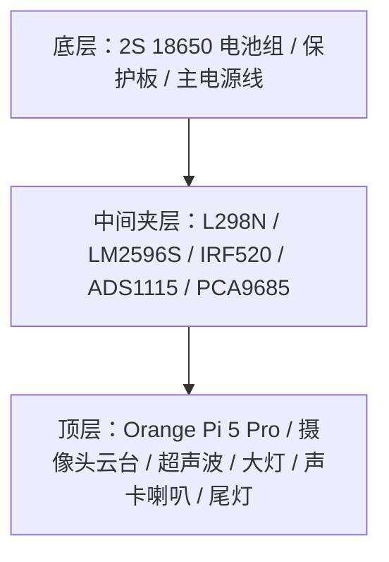

# 小橙硬件接线文档

> 物理层唯一信息源。所有引脚映射、接线、电源拓扑只在此文件维护。  
> 其他文档引用此文件，不复制内容。

---

## 1. 开发板基本信息

- **型号**：Orange Pi 5 Pro
- **SoC**：Rockchip RK3588S（8核，6TOPS NPU）
- **GPIO 库**：wiringOP-Python
- **40-pin IO 电压**：全部 3.3V

```
 +------+-----+----------+--------+---+  PI5 PRO +---+--------+----------+-----+------+
 | GPIO | wPi |   Name   |  Mode  | V | Physical | V |  Mode  | Name     | wPi | GPIO |
 +------+-----+----------+--------+---+----++----+---+--------+----------+-----+------+
 |      |     |     3.3V |        |   |  1 || 2  |   |        | 5V       |     |      |
 |   59 |   0 |    SDA.1 |     IN | 1 |  3 || 4  |   |        | 5V       |     |      |
 |   58 |   1 |    SCL.1 |     IN | 1 |  5 || 6  |   |        | GND      |     |      |
 |   47 |   2 |    PWM13 |     IN | 1 |  7 || 8  | 1 | ALT10  | TXD.2    | 3   | 13   |
 |      |     |      GND |        |   |  9 || 10 | 1 | ALT10  | RXD.2    | 4   | 14   |
 |  138 |   5 |  CAN1_RX |     IN | 1 | 11 || 12 | 1 | IN     | GPIO1_A7 | 6   | 39   |
 |  139 |   7 |  CAN1_TX |     IN | 1 | 13 || 14 |   |        | GND      |     |      |
 |   46 |   8 | GPIO1_B6 |     IN | 1 | 15 || 16 | 0 | IN     | TXD.6    | 9   | 33   |
 |      |     |     3.3V |        |   | 17 || 18 | 0 | IN     | RXD.6    | 10  | 32   |
 |   42 |  11 | SPI0_TXD |     IN | 0 | 19 || 20 |   |        | GND      |     |      |
 |   41 |  12 | SPI0_RXD |     IN | 0 | 21 || 22 | 1 | IN     | GPIO1_B0 | 13  | 40   |
 |   43 |  14 | SPI0_CLK |     IN | 0 | 23 || 24 | 1 | IN     | SPI0_CS0 | 15  | 44   |
 |      |     |      GND |        |   | 25 || 26 | 1 | IN     | SPI0_CS1 | 16  | 45   |
 |   34 |  17 |    SDA.4 |     IN | 0 | 27 || 28 | 0 | IN     | SCL.4    | 18  | 35   |
 |   36 |  19 | GPIO1_A4 |     IN | 0 | 29 || 30 |   |        | GND      |     |      |
 |   38 |  20 | GPIO1_A6 |     IN | 0 | 31 || 32 | 1 | IN     | PWM14    | 21  | 62   |
 |   63 |  22 |    PWM15 |     IN | 1 | 33 || 34 |   |        | GND      |     |      |
 |  135 |  23 | GPIO4_A7 |     IN | 0 | 35 || 36 | 0 | IN     | TXD.0    | 24  | 131  |
 |  134 |  25 | GPIO4_A6 |     IN | 0 | 37 || 38 | 0 | IN     | RXD.0    | 26  | 132  |
 |      |     |      GND |        |   | 39 || 40 | 0 | IN     | GPIO4_A5 | 27  | 133  |
 +------+-----+----------+--------+---+----++----+---+--------+----------+-----+------+
 | GPIO | wPi |   Name   |  Mode  | V | Physical | V |  Mode  | Name     | wPi | GPIO |
 +------+-----+----------+--------+---+  PI5 PRO +---+--------+----------+-----+------+
```


---

## 2. 机械层级与走线原则

当前布局按三层区域组织：



| 层级 | 固定布局 | 走线重点 |
|---|---|---|
| 底层 | 电池组和保护板 | BAT+ / GND 上引到中间层，电机电源线尽量短且粗 |
| 中间夹层 | L298N 居中偏前；左侧 LM2596S + IRF520；右侧 ADS1115 + PCA9685 | 电源相关集中左侧，I2C 设备集中右侧，减少交叉线 |
| 顶层 | OPi 5 Pro 居中架高；40pin 朝左；USB 朝后 | 40pin 线束从左侧下到中间层；USB 声卡插后侧；前端留给云台/摄像头/超声波/大灯 |

**固定方向约定：**
- 车头 = 云台 + OV5640 + HC-SR04 + 双大灯所在方向
- 车尾 = WS2812B 灯带所在方向
- OPi 40pin 排针朝左，便于接中间层控制线和 I2C 线
- OPi 用铜柱架高，底部保留散热和理线空间

**线束原则：**

- 电源线（BAT+、5V、GND、电机线）与信号线分侧走，交叉时尽量垂直交叉
- I2C 只从 OPi 引出一组 SDA/SCL 到中间层右侧，再分给 ADS1115 和 PCA9685
- 共地必须可靠：电池 GND、L298N、LM2596S、IRF520、ADS1115、PCA9685、OPi 必须同地

---

## 3. 电源拓扑

```
EVE 18650 × 2（2S1P）
  │
  ├─ 原始电池输出（7.4V 标称，8.4V 满电，6.0V 截止）
  │     │
  │     ├─ L298N VCC/VMS（电机驱动电源，直接接电池）
  │     ├─ ADS1115 分压采样输入（20KΩ + 10KΩ）
  │     └─ 3W LED 供电（如 LED 规格允许走电池轨）
  │
  └─ LM2596S 降压模块
        │  输入：电池正/GND
        │  输出：5.0V（调好后再接 OPi！）
        │
        ├─ Orange Pi 5 Pro（5V Type-C 供电）
        │      ├─ ADS1115 VDD（3.3V 由 OPi 40pin 提供）
        │      └─ PCA9685 VCC（3.3V 逻辑供电）
        │
        └─ 5V 外设轨（PCA9685 V+ / WS2812B / HC-SR04，按电流余量接入）

所有模块共用电池 GND（共地）。
```

**关键风险：** LM2596S 需要约 7V 最低输入才能稳定输出 5V。电池从 8.4V 放至 7.0V 时，剩余容量约 20-30% 已无法安全给 OPi 供电。这意味着有效可用容量约为标称容量的 70-80%。→ **ADS1115 电压监控是安全必选项，不是可选功能。**

**上电顺序：**
1. 先调好 LM2596S 输出（用万用表确认 5.0V ± 0.1V）
2. 再接 OPi Type-C

---

## 4. 电机驱动（L298N）引脚映射

| 信号 | L298N 端子 | OPi 物理引脚 | wPi 编号 | sysfs 路径 | 备注 |
|---|---|---|---|---|---|
| ENA（左 PWM） | ENA | 7 | 2 | `/sys/class/pwm/pwmchip2/pwm0` | PWM13_M2，febf0010.pwm |
| IN1（左方向A） | IN1 | 11 | 5 | GPIO | — |
| IN2（左方向B） | IN2 | 13 | 7 | GPIO | — |
| ENB（右 PWM） | ENB | 32 | 21 | `/sys/class/pwm/pwmchip3/pwm0` | PWM14_M2，febf0020.pwm |
| IN3（右方向A） | IN3 | 22 | 13 | GPIO | — |
| IN4（右方向B） | IN4 | 26 | 16 | GPIO | — |
| GND | GND | 任意 GND pin | — | — | 共地！ |

**PWM 参数（已验证）：**

- Period：1,000,000 ns（1kHz）
- 极性：`inversed`（`PWM_INVERTED = True`），RK3588S 实测极性反转
- 死区：40%（低于此占空比电机不转）

**orangepi-config 中需启用的 overlay：**
- `pwm13-m2`
- `pwm14-m2`

---

## 5. I2C 总线与 ADS1115 电池电压监控

I2C 设备集中在中间层右侧，ADS1115 与 PCA9685 共用 OPi 的 I2C1_M4：

| 设备 | 默认地址 | 用途 | 位置 |
|---|---|---|---|
| ADS1115 | `0x48` | 电池电压采样 | 中间层右侧 |
| PCA9685 | `0x40` | SG90 云台舵机 PWM | 中间层右侧 |

| I2C 信号 | OPi 物理引脚 | 连接方式 |
|---|---|---|
| SDA | 3（SDA.1） | 一根主线下引到中间层右侧，再分到 ADS1115/PCA9685 |
| SCL | 5（SCL.1） | 一根主线下引到中间层右侧，再分到 ADS1115/PCA9685 |
| 3.3V | 1（3.3V） | 给 ADS1115 VDD、PCA9685 VCC 逻辑供电 |
| GND | 6 或 9（GND） | 接中间层共地 |

| 信号 | ADS1115 引脚 | OPi 物理引脚 | 备注 |
|---|---|---|---|
| VCC | VDD | 1（3.3V） | 3.3V 供电 |
| GND | GND | 6（GND） | — |
| SDA | SDA | 3（SDA.1） | I2C1_M4 总线 |
| SCL | SCL | 5（SCL.1） | I2C1_M4 总线 |
| A0 | A0 | — | 接分压器输出 |
| ADDR | ADDR | GND | I2C 地址 = 0x48 |

**分压电路：**
```
电池正极
    │
   20KΩ（上分压电阻）
    │
    ├─── → ADS1115 A0（测量点）
    │
   10KΩ（下分压电阻）
    │
   GND

分压比：10K / (20K + 10K) = 1/3
实际电压 = ADC读值 × 3
满电 8.4V → ADC测 2.8V；截止 6.0V → ADC测 2.0V
```

**I2C 总线冲突检查（已确认无冲突）：**
- 物理脚 3/5（I2C1_M4）与电机引脚 7/11/13/22/26/32 无重叠
- ADS1115 默认 `0x48`，PCA9685 默认 `0x40`，地址无冲突

**验证命令：**
```bash
# 检测 I2C 设备是否被识别
i2cdetect -y 1
# ADS1115 应在 0x48；PCA9685 接入后应在 0x40
```

---

## 6. 已规划外设（待接线，按 Phase 排列）

### Phase 3 — OV5640 摄像头
- 安装位：顶层最前端正中央，和云台同轴
- 接口按手头模块确认：CSI/MIPI 走排线；USB UVC 才接 OPi USB
- 后侧 USB 优先留给免驱声卡，摄像头线从前端就近固定，避免压到云台

### Phase 4 — HC-SR04 超声波
- 安装位：顶层最前端正中央，靠近云台/摄像头
- VCC → 5V 外设轨
- GND → GND
- Trig → 待定 GPIO
- Echo → **注意：HC-SR04 Echo 输出 5V 电平，需分压到 3.3V 才能接 OPi GPIO**（2KΩ + 1KΩ 分压，或用电平转换模块）

### Phase 6 — SG90 云台（PCA9685 驱动）
- 云台安装位：顶层前端正中央，摄像头固定在云台上
- PCA9685 放中间层右侧，与 ADS1115 共用 I2C1_M4（SDA/SCL）
- PCA9685 VCC 接 3.3V 逻辑电源，V+ 接独立 5V 舵机电源
- SG90 × 2：Pan + Tilt；舵机电源不要走 OPi 3.3V 轨

### Phase 8 — 车灯系统
- **3W LED × 2**：安装在顶层前端左右两角；IRF520 放中间层左侧，与 LM2596S 同属电源区
- IRF520：Gate/SIG 接 OPi GPIO，Source/GND 接共地，Drain/OUT 接 LED 负极；LED 正极接 5V 或电池轨（按 LED 规格确认）
- **WS2812B RGB 灯带**：沿顶层后沿粘贴作尾灯；DATA 接 SPI MOSI 或待定 GPIO；需 3.3V → 5V 电平转换（74AHCT125 或类似）；独立 5V 供电

### Phase 9 — USB 声卡 + 喇叭
- USB 声卡直接插 OPi 后侧 USB 口
- 喇叭用双面胶贴在声卡旁边，音频线尽量短
- 无需占用 40pin GPIO

---

## 7. 已踩坑 / 注意事项

**坑 1：ENB 跳线帽**  
L298N 的 ENA/ENB 引脚有跳线帽短接 5V（出厂默认全速模式）。接 PWM 控速前必须**拔掉跳线帽**，否则 PWM 信号无效，电机始终全速。

**坑 2：PWM 极性反转**  
RK3588S 上 sysfs PWM 极性默认为 normal，但实测行为是 inversed（占空比越高速度越低）。必须显式设置 `polarity = inversed`，对应代码中 `PWM_INVERTED = True`。

**坑 3：PWM 芯片路径**  
不同 SoC 的 pwmchip 编号不同。OPi 5 Pro (RK3588S) 上：

- PWM13_M2 → pwmchip2（febf0010.pwm），物理引脚 7
- PWM14_M2 → pwmchip3（febf0020.pwm），物理引脚 32

**此路径在 OPi 4 Pro (Allwinner) 上不同，切换板子时务必重新确认。**

**坑 4：杜邦线接触不良**  
电机驱动 IN1-IN4 接线如出现方向异常或电机不转，优先怀疑杜邦线接触不良（尤其是用了多次的线）。换新线或用万用表通断测试。

**坑 5：LM2596S 调压顺序**  
先调压再接负载（OPi）。逆时针调节电位器增大输出电压，顺时针减小。调好后输出接万用表确认，稳定在 5.0V ± 0.1V 后再接 OPi。

**坑 6：HC-SR04 电平（提醒）**  
Echo 引脚输出 5V 电平，直接接 OPi 3.3V GPIO 可能损坏 IO。Phase 4 接线时必须加分压电路或电平转换模块。
