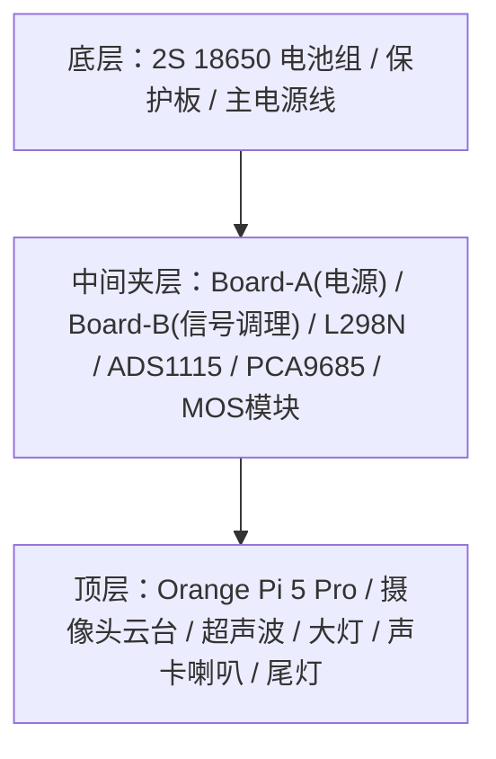

# 小橙硬件清单与接线文档

> 物理层唯一信息源。零件清单、引脚映射、接线、电源拓扑只在此文件维护。  
> 其他文档引用此文件，不复制内容。  
> 最后更新：Phase 2.pre 完成 + 全 Phase 引脚预留钉死（Phase 8/6/15 预留），并入硬件清单总览

---

## 0. 硬件清单总览（零件册）

> 全车硬件的「是什么 / 干什么 / 怎么供电 / 接到哪 / 状态」速查索引。
> 引脚/接线细节以下方各节为准，本表只做总览。
> 状态：✅已接能用 ｜ 📋待接 ｜ 🔒预留(暂不接)

### 0.1 核心控制 & 电源

| # | 硬件 | 作用 | 供电 | 连接到哪 | 状态 |
|---|---|---|---|---|---|
| 1 | Orange Pi 5 Pro | 主控大脑(后端/视觉/NPU) | LM2596S#1 → 5V Type-C | 40pin 引出全部信号 | ✅ |
| 2 | EVE 18650 ×2 (2S1P) | 全车动力源 7.4V(满8.4/截止6.0) | — | 经保护板 → 主电源轨 | ✅ |
| 3 | 18650 3A 过充保护板 | 电池过充/过放/过流保护 | 串在电池组 | 电池 ↔ 主电源轨 | ✅ |
| 4 | LM2596S #1 | 降压→5V，**专供 OPi**(干净轨) | 电池原始轨 | 输出→KF301端子→OPi | ✅ |
| 5 | LM2596S #2 | 降压→5V，**专供外设轨** | 电池原始轨 | →PCA9685/HC-SR04/灯带/74AHCT125 | ✅ |

### 0.2 运动 & 传感

| # | 硬件 | 作用 | 供电 | 连接到哪 | 状态 |
|---|---|---|---|---|---|
| 6 | L298N 电机驱动 | 驱动左右电机(差速) | 电池原始轨(VMS) | ENA=7,IN1=11,IN2=13 / ENB=32,IN3=22,IN4=26 | ✅ |
| 7 | 黄色减速电机 ×4 | 四驱轮子 | L298N 输出 | 左右各并联 | ✅ |
| 8 | ZY-ADS1115 (ADC) | 读电池电压(安全告警) | OPi 3.3V (Pin1) | I2C 0x48，SDA=3/SCL=5；A0经20K/10K分压 | ✅ |
| 9 | HC-SR04 ×2 | 前/后超声波测距 | OPi 3.3V（RCWL-9200 宽压版） | 前:Trig29/Echo31；后:Trig35/Echo37（3.3V供电直连，无需分压，见坑6） | 📋 |

### 0.3 视觉 & 云台（双摄双云台）

| # | 硬件 | 作用 | 安装位 | 连接到哪 | 状态 |
|---|---|---|---|---|---|
| 10 | **OV13855 (1300万)** | **前置**主摄(FPV/视觉主力) | 前云台 | OPi 摄像头接口 | 📋 |
| 11 | **OV5640 (500万)** | **后置**摄像头(倒车/后视) | 后云台 | `/dev/video0`(USB/MIPI) | ✅软件 |
| 12 | PCA9685A | 16路PWM驱动舵机(不占40pin) | Board-B旁立柱 | I2C 0x40，SDA=3/SCL=5；V+走#2轨 | 📋 |
| 13 | 前云台 SG90 ×2 | 前摄 pan/tilt | 车头 | PCA9685 CH0=Pan / CH1=Tilt | 📋 |
| 14 | 后云台 SG90 ×2 | 后摄 pan/tilt | 车尾 | PCA9685 CH3=Pan / CH4=Tilt | 📋 |
| (15)| 前超声波扫描舵机 | (可选)前超声波摆扫 | 车头 | PCA9685 CH2 | 📋 |

> 双云台最多 4 个舵机；PCA9685 16 路足够，通道分配见上。

### 0.4 灯光 & 声音

| # | 硬件 | 作用 | 供电 | 连接到哪 | 状态 |
|---|---|---|---|---|---|
| 16 | **3W LED 大灯 ×2(自带驱动)** | 前照灯(PWM调光) | 正极→电池轨 | **信号→Pin33 直接接**(逻辑/PWM输入)；负极→共地 | 📋 |
| 17 | WS2812B RGB 灯带 | 尾灯/氛围灯(10灯珠) | LM2596S#2 5V独立 | DATA=Pin19→74AHCT125升压→DIN | 📋 |
| 18 | 74AHCT125 | 电平转换 3.3V→5V(灯带信号) | #2轨 5V | Board-B 上 | 📋 |
| 19 | USB 声卡(免驱) | 音频输出 | OPi USB | 后侧 USB 口 | ✅ |
| 20 | 8Ω 2W 小喇叭 | 鸣笛/语音/提示音 | USB声卡功放 | 接声卡输出 | ✅ |

> ⚠️ **大灯自带驱动模块**，信号脚为 3.3V 逻辑/PWM 输入，可直连 Pin33；原计划的「MOS 触发驱动模块」已取消、收为备件（详见第 8 节 Phase 8 与坑 7）。

### 0.5 接插件 & 万能板

| # | 硬件 | 作用 | 用在哪 |
|---|---|---|---|
| 21 | 万能板(洞洞板) ×2 | Board-A配电汇流 / Board-B信号调理 | A:配电+共地星点；B:分压+电平转换+I2C扇出 |
| 22 | KF301-3P 接线端子 | 免焊可拆螺丝端子 | 一组管3线(5V/GND/信号)，电池进线/各路抽头/OPi输出预留位 |
| 23 | 排针 | 模块间杜邦线插拔接口 | 万能板上做插拔，避免死焊 |

### 0.6 Phase 15 预留（暂不接）

| # | 硬件 | 作用 | 状态 |
|---|---|---|---|
| 24 | ESP32-C3 | 带外电源管家(优雅关机/唤醒) | 🔒预留 Pin16/18 |
| 25 | AMS1117-3.3 | 给 ESP32 常供 3.3V | 🔒预留焊位 |

---

## 1. 开发板基本信息

- **型号**：Orange Pi 5 Pro
- **SoC**：Rockchip RK3588S（8核，6TOPS NPU）
- **GPIO 库**：wiringOP-Python
- **40-pin IO 电压**：全部 3.3V

```
 +------+-----+----------+--------+---+  PI5 PRO +---+--------+----------+-----+------+
 | GPIO | wPi |   Name   |  Mode  | V | Physical | V |  Mode  | Name     | wPi | GPIO |
 +------+-----+----------+--------+---+----++----+---+--------+----------+-----+------+
 |      |     |     3.3V |        |   |  1 || 2  |   |        | 5V       |     |      |
 |   59 |   0 |    SDA.1 |     IN | 1 |  3 || 4  |   |        | 5V       |     |      |
 |   58 |   1 |    SCL.1 |     IN | 1 |  5 || 6  |   |        | GND      |     |      |
 |   47 |   2 |    PWM13 |     IN | 1 |  7 || 8  | 1 | ALT10  | TXD.2    | 3   | 13   |
 |      |     |      GND |        |   |  9 || 10 | 1 | ALT10  | RXD.2    | 4   | 14   |
 |  138 |   5 |  CAN1_RX |     IN | 1 | 11 || 12 | 1 | IN     | GPIO1_A7 | 6   | 39   |
 |  139 |   7 |  CAN1_TX |     IN | 1 | 13 || 14 |   |        | GND      |     |      |
 |   46 |   8 | GPIO1_B6 |     IN | 1 | 15 || 16 | 0 | IN     | TXD.6    | 9   | 33   |
 |      |     |     3.3V |        |   | 17 || 18 | 0 | IN     | RXD.6    | 10  | 32   |
 |   42 |  11 | SPI0_TXD |     IN | 0 | 19 || 20 |   |        | GND      |     |      |
 |   41 |  12 | SPI0_RXD |     IN | 0 | 21 || 22 | 1 | IN     | GPIO1_B0 | 13  | 40   |
 |   43 |  14 | SPI0_CLK |     IN | 0 | 23 || 24 | 1 | IN     | SPI0_CS0 | 15  | 44   |
 |      |     |      GND |        |   | 25 || 26 | 1 | IN     | SPI0_CS1 | 16  | 45   |
 |   34 |  17 |    SDA.4 |     IN | 0 | 27 || 28 | 0 | IN     | SCL.4    | 18  | 35   |
 |   36 |  19 | GPIO1_A4 |     IN | 0 | 29 || 30 |   |        | GND      |     |      |
 |   38 |  20 | GPIO1_A6 |     IN | 0 | 31 || 32 | 1 | IN     | PWM14    | 21  | 62   |
 |   63 |  22 |    PWM15 |     IN | 1 | 33 || 34 |   |        | GND      |     |      |
 |  135 |  23 | GPIO4_A7 |     IN | 0 | 35 || 36 | 0 | IN     | TXD.0    | 24  | 131  |
 |  134 |  25 | GPIO4_A6 |     IN | 0 | 37 || 38 | 0 | IN     | RXD.0    | 26  | 132  |
 |      |     |      GND |        |   | 39 || 40 | 0 | IN     | GPIO4_A5 | 27  | 133  |
 +------+-----+----------+--------+---+----++----+---+--------+----------+-----+------+
 | GPIO | wPi |   Name   |  Mode  | V | Physical | V |  Mode  | Name     | wPi | GPIO |
 +------+-----+----------+--------+---+  PI5 PRO +---+--------+----------+-----+------+
```

---

## 2. 机械层级与走线原则

当前布局按三层区域组织：



| 层级 | 固定布局 | 走线重点 |
|---|---|---|
| 底层 | 电池组和保护板 | BAT+/GND 上引到中间层，电机电源线尽量短且粗 |
| 中间夹层 | L298N 居中偏前；左侧 Board-A（电源）；右侧 Board-B（信号调理）+ ADS1115 + PCA9685 | 电源相关集中左侧，I2C/信号设备集中右侧，减少交叉线 |
| 顶层 | OPi 5 Pro 居中架高；40pin 朝左；USB 朝后 | 40pin 线束从左侧下到中间层；USB 声卡插后侧；前端留给云台/摄像头/超声波/大灯 |

**固定方向约定：**
- 车头 = 云台 + OV5640 + HC-SR04(前) + 双大灯所在方向
- 车尾 = WS2812B 灯带所在方向
- OPi 40pin 排针朝左，便于接中间层控制线和 I2C 线
- OPi 用铜柱架高，底部保留散热和理线空间

**线束原则：**
- 电源线（BAT+、5V、GND、电机线）与信号线分侧走，交叉时尽量垂直交叉
- I2C 只从 OPi 引出一组 SDA/SCL 到 Board-B，再分给 ADS1115 和 PCA9685
- 共地必须可靠：电池 GND、L298N、LM2596S×2、MOS模块、ADS1115、PCA9685、OPi 必须同地，统一汇到 Board-A 的共地星点
- **Board-A 上 LM2596S#1 输出侧接 KF301-2P 端子，不焊死**——预留插入 ESP32 高边开关的位置（Phase 15）

---

## 3. 电源拓扑

```
EVE 18650 × 2（2S1P）
  │
  ├─ 原始电池输出（7.4V 标称，8.4V 满电，6.0V 截止）
  │     │
  │     ├─ L298N VCC/VMS（电机驱动电源，直接接电池）
  │     ├─ ADS1115 分压采样输入（20KΩ + 10KΩ）
  │     ├─ 大灯供电（3W LED×2，自带驱动，正极走电池轨，信号直连 Pin33）
  │     └─ [Phase 15 预留] AMS1117-3.3 输入（电池→AMS1117→3.3V→ESP32-C3 常供）
  │
  └─ Board-A：双 LM2596S 降压
        │
        ├─ LM2596S #1（专供 OPi，独立干净轨）
        │     输出：5.0V
        │     → [KF301-2P 端子，不焊死] → OPi 5 Pro（5V Type-C）
        │     ⚠️ 端子中间预留插入高边开关位置（Phase 15 ESP32 电源管家接入点）
        │
        └─ LM2596S #2（专供 5V 外设轨）
              输出：5.0V
              ├─ PCA9685 V+（舵机电源）
              ├─ HC-SR04 × 2（VCC）
              ├─ WS2812B（独立 5V 供电）
              └─ 74AHCT125（VCC）

所有模块共用电池 GND（共地），统一汇到 Board-A 共地星点。
```

**双 LM2596S 分轨理由：** OPi 在 YOLO 推理峰值可达 2~3A，大灯+舵机堵转峰值合计 ~2A，单模块（额定 2~3A 连续）无法可靠承载两者叠加，且电机/灯的电流尖峰会污染 OPi 供电导致掉电重启。

**关键风险（同前）：** LM2596S 需要约 7V 最低输入才能稳定输出 5V，电池低于此电压两路同时失效。ADS1115 电压监控告警阈值 7.2V，是安全必选项。

**上电顺序：**
1. 先分别调好两块 LM2596S 输出（万用表确认 5.0V ± 0.1V，空载状态下调）
2. #1 接 OPi Type-C，#2 接外设

---

## 4. 40-pin 引脚总分配表

> 全项目唯一引脚注册表。新增外设使用引脚前必须在此确认无冲突，再接线。

| 物理脚 | 信号名 | 用途 | Phase | 状态 |
|---|---|---|---|---|
| 1 | 3.3V | I2C 设备逻辑供电（ADS1115/PCA9685） | P2.pre | ✅ 已接 |
| 3 | SDA.1 | I2C1_M4 SDA（ADS1115 + PCA9685） | P2.pre | ✅ 已接 |
| 5 | SCL.1 | I2C1_M4 SCL（ADS1115 + PCA9685） | P2.pre | ✅ 已接 |
| 6 | GND | I2C 设备共地 | P2.pre | ✅ 已接 |
| 7 | PWM13_M2 | 左电机 ENA（PWM 调速） | P2.1 | ✅ 已接 |
| 11 | CAN1_RX(GPIO) | 左电机 IN1（方向 A） | P2.1 | ✅ 已接 |
| 13 | CAN1_TX(GPIO) | 左电机 IN2（方向 B） | P2.1 | ✅ 已接 |
| 16 | TXD.6 | **[预留] ESP32 UART RX**（OPi→ESP32 优雅关机握手） | P15 | 🔒 预留 |
| 18 | RXD.6 | **[预留] ESP32 UART TX**（ESP32→OPi 唤醒/关机指令） | P15 | 🔒 预留 |
| 19 | SPI0_TXD(MOSI) | WS2812B DATA（经 74AHCT125 升 5V） | P8 | 📋 待接 |
| 22 | GPIO1_B0 | 右电机 IN3（方向 A） | P2.1 | ✅ 已接 |
| 26 | SPI0_CS1(GPIO) | 右电机 IN4（方向 B） | P2.1 | ✅ 已接 |
| 29 | GPIO1_A4 | 前超声波 Trig | P6 | 📋 待接 |
| 31 | GPIO1_A6 | 前超声波 Echo（经 2KΩ/1KΩ 分压） | P6 | 📋 待接 |
| 32 | PWM14_M2 | 右电机 ENB（PWM 调速） | P2.1 | ✅ 已接 |
| 33 | PWM15_M2 | 大灯信号 SIG（自带驱动，PWM 调光，直连） | P8 | 📋 待接 |
| 35 | GPIO4_A7 | 后超声波 Trig | P6 | 📋 待接 |
| 37 | GPIO4_A6 | 后超声波 Echo（经 2KΩ/1KΩ 分压） | P6 | 📋 待接 |

**空闲脚（可用）：** 8/10(TXD.2/RXD.2)、12、15、21、23/24/25(SPI0)、27/28(SDA.4/SCL.4)、36/38/40  
**云台舵机（pan/tilt/前扫描）：** 全部走 PCA9685 CH0/1/2，不占 40-pin。

---

## 5. 电机驱动（L298N）引脚映射

| 信号 | L298N 端子 | OPi 物理引脚 | wPi 编号 | sysfs 路径 | 备注 |
|---|---|---|---|---|---|
| ENA（左 PWM） | ENA | 7 | 2 | `/sys/class/pwm/pwmchip2/pwm0` | PWM13_M2，febf0010.pwm |
| IN1（左方向A） | IN1 | 11 | 5 | GPIO | — |
| IN2（左方向B） | IN2 | 13 | 7 | GPIO | — |
| ENB（右 PWM） | ENB | 32 | 21 | `/sys/class/pwm/pwmchip3/pwm0` | PWM14_M2，febf0020.pwm |
| IN3（右方向A） | IN3 | 22 | 13 | GPIO | — |
| IN4（右方向B） | IN4 | 26 | 16 | GPIO | — |
| GND | GND | 任意 GND pin | — | — | 共地！ |

**PWM 参数（已验证）：**
- Period：1,000,000 ns（1kHz）
- 极性：`inversed`（`PWM_INVERTED = True`），RK3588S 实测极性反转
- 死区：40%（低于此占空比电机不转）

**orangepi-config 中需启用的 overlay：**
- `pwm13-m2`
- `pwm14-m2`

---

## 6. I2C 总线与 ADS1115 电池电压监控

I2C 设备集中在 Board-B（中间层右侧），ADS1115 与 PCA9685 共用 OPi 的 I2C1_M4：

| 设备 | 默认地址 | 用途 | 位置 |
|---|---|---|---|
| ADS1115 | `0x48` | 电池电压采样 | Board-B |
| PCA9685 | `0x40` | SG90 云台舵机 PWM（CH0 pan / CH1 tilt / CH2 前扫描舵机） | Board-B 旁立柱架 |

| I2C 信号 | OPi 物理引脚 | 连接方式 |
|---|---|---|
| SDA | 3（SDA.1） | 一根主线下引到 Board-B，再分到 ADS1115/PCA9685 |
| SCL | 5（SCL.1） | 一根主线下引到 Board-B，再分到 ADS1115/PCA9685 |
| 3.3V | 1（3.3V） | 给 ADS1115 VDD、PCA9685 VCC 逻辑供电 |
| GND | 6 或 9（GND） | 接 Board-A 共地星点 |

**分压电路（已验证）：**
```
电池正极
    │
   20KΩ（上分压电阻）
    │
    ├─── → ADS1115 A0（测量点）
    │
   10KΩ（下分压电阻）
    │
   GND

分压比：10K / (20K + 10K) = 1/3（理论值，待万用表校准）
实际电压 = ADC读值 × 3
满电 8.4V → ADC测 2.8V；截止 6.0V → ADC测 2.0V
```

**验证命令：**
```bash
i2cdetect -y 1
# ADS1115 应在 0x48；PCA9685 接入后应在 0x40
```

---

## 7. 万能板规划

使用 2 块 7×9 万能板（剩余备用），外加成品模块立柱架设：

### Board-A｜电源 + 共地星点（中间层左）

- 2× LM2596S（#1 专供 OPi，#2 专供 5V 外设轨）
- 三条汇流：电池原始轨 / 5V 外设轨 / **全车唯一共地星点**
- KF301-2P：电池进线 / 各外设 5V-GND 抽头 / **LM2596S#1 输出侧（不焊死，预留 Phase 15 高边开关插入位）**
- [Phase 15 预留位] AMS1117-3.3 焊位（电池→AMS1117→3.3V→ESP32 常供），本次留空不焊

### Board-B｜信号调理 + I2C 汇集（中间层右）

- 2× HC-SR04 Echo 分压电路（2KΩ + 1KΩ，共 4 颗电阻）
- 74AHCT125 电平转换（SPI0 MOSI 3.3V → WS2812B DATA 5V）
- I2C 从 OPi 单组进，板上扇出给 ADS1115 和 PCA9685
- ADS1115 已焊在旁边，PCA9685 成品模块立柱架在 Board-B 右侧

### 成品模块（立柱架，不占万能板）

- PCA9685（I2C 从 Board-B 取，V+ 接 #2 外设轨）
- ~~MOS 触发驱动模块~~ —— **已取消**：大灯自带驱动，信号直连 Pin33（详见 Phase 8）

---

## 8. 已规划外设（按 Phase 排列）

### Phase 3 — 摄像头（前后双摄）
- **前置：OV13855（1300 万像素）** —— FPV/视觉推理主力，固定在**前云台**
- **后置：OV5640（500 万像素）** —— 倒车/后视，固定在**后云台**；软件侧 OpenCV V4L2 + MJPEG endpoint 已实现（`/dev/video0`）✅
- 安装位：前摄在车头前端，后摄在车尾

### Phase 4 — PCA9685 + SG90 双云台
- PCA9685 I2C 地址 0x40，与 ADS1115 共用 I2C1_M4（SDA/SCL Pin3/5）
- **前后双云台，最多 4 个 SG90**，PCA9685 16 路足够，通道分配：
  - CH0 = 前云台 Pan，CH1 = 前云台 Tilt
  - CH3 = 后云台 Pan，CH4 = 后云台 Tilt
  - CH2 = 前超声波扫描舵机（到货后，可选）
- SG90 电源走 LM2596S #2 外设轨 5V（不走 OPi 3.3V 轨）

### Phase 6 — HC-SR04 超声波（前后双）

> ⚠️ **实物为 HC-SR04 2021 款（RCWL-9200 解调芯片，宽压 2.8-5.5V）。**
> 此款 Echo 输出电平 = 供电电压，故 **采用 3.3V 供电 → Echo 即为 3.3V → 无需分压电路**。
> RCWL-9200 在 3.3V 下量程/盲区不缩水（等价 HC-SR04P），与老款分立晶振方案不同。
> **决策：放弃 Board-B 上的 2 路 Echo 分压（4 颗电阻不焊）。** 详见坑 6。

| 方向 | Trig | Echo | 处理 |
|---|---|---|---|
| 前 | Pin 29（GPIO直出） | Pin 31（直连，无分压） | 3.3V 供电，Echo 直接 3.3V |
| 后 | Pin 35（GPIO直出） | Pin 37（直连，无分压） | 3.3V 供电，Echo 直接 3.3V |

- **VCC → OPi 3.3V（Pin1 或 3.3V 轨），不接 5V**；GND → 共地星点

### Phase 8 — 车灯系统

**3W LED × 2（大灯，自带驱动模块，并联单路控制）：**
- ✅ **大灯自带驱动电路**（恒流/MOS），引出 3 母头：**正、负、信号**
- 信号脚为 **3.3V 逻辑/PWM 输入**，**直接接 Pin 33（PWM15_M2）**，需启用 `pwm15-m2` overlay
- 正极 → 电池原始轨；负极 → 共地星点；信号 → Pin 33
- ⚠️ **不再需要外接 MOS 触发驱动模块**（原规划已取消，模块收为备件）
- 两颗并联接法：正极并接、负极并接、信号并接，当作一个负载

**WS2812B RGB 灯带（10 灯珠，尾灯）：**
- DATA 信号：Pin 19（SPI0 MOSI）驱动；需启用 SPI0 overlay
- **5V 供电接 LM2596S #2 外设轨（非 OPi 轨 #1）** —— 灯带电流尖峰会污染 OPi 供电导致掉电重启（10 颗满白峰值约 0.6A，#2 轨可承载）
- **电平转换：必须做（已实测确认）。** 2026-06-24 实测：信号直连 Pin 19（灯带 5V 供电），**第一颗灯随机错色/乱闪、连"熄灭"帧都 latch 不稳；第 2~10 颗全部正常**——典型 3.3V 信号低于 WS2812（5V 供电，阈值约 3.5V）的临界症状（首颗直吃 3.3V，其后被首颗整形为 5V 故正常）。**结论：直连不可用。**
  - 选定方案：**74AHCT125（DIP-14 直插，SN74AHCT125N）** 做 3.3V→5V 电平转换，Board-B 上预留位
  - 备选快速方案：灯带 VCC 串一颗二极管（如 1N4007，5V→~4.3V，逻辑阈值降到 ~3V，3.3V 信号即可识别），灯略暗
  - ⚠️ 电容**不能**替代二极管做降压（稳态无固定压降）
  - 测试脚本：[python_test/test_strip.py](../python_test/test_strip.py)（spidev 显式锁 6.4MHz）；启用 overlay：`orangepiEnv.txt` 加 `spi0-m2-cs0-spidev`（用 cs0 版避开 Pin26 右电机 IN4）
- ⚠️ WS2812 必须由 OPi SPI 硬件按时序驱动，**PCA9685/PCA9675 等 I2C PWM/GPIO 芯片无法驱动灯带**

### Phase 15 — ESP32-C3 带外电源管理（独立立项）
- 接入点：Board-A 上 LM2596S#1 输出 KF301 端子中间，插入高边开关（P-MOS 或负载开关 IC）
- ESP32 供电：AMS1117-3.3（电池→AMS1117→3.3V），独立于 OPi 供电轨，常供
- 握手 UART：Pin 16（TXD.6）= OPi TX → ESP32 RX；Pin 18（RXD.6）= OPi RX → ESP32 TX
- 关机流程：ESP32 → UART → OPi `systemctl poweroff` → OPi GPIO 回告"安全断电" → ESP32 断高边开关
- **本次布线只预留 Board-A KF301 端子位和 AMS1117 焊位，Pin16/18 暂不接线**

### Phase 9 — USB 声卡 + 喇叭 ✅
- USB 声卡直接插 OPi 后侧 USB 口，无需 GPIO

---

## 9. 已踩坑 / 注意事项

**坑 1：ENB 跳线帽**  
L298N 的 ENA/ENB 引脚有跳线帽短接 5V（出厂默认全速模式）。接 PWM 控速前必须**拔掉跳线帽**，否则 PWM 信号无效，电机始终全速。

**坑 2：PWM 极性反转**  
RK3588S 上 sysfs PWM 极性默认为 normal，但实测行为是 inversed（占空比越高速度越低）。必须显式设置 `polarity = inversed`，对应代码中 `PWM_INVERTED = True`。

**坑 3：PWM 芯片路径**  
不同 SoC 的 pwmchip 编号不同。OPi 5 Pro (RK3588S) 上：
- PWM13_M2 → pwmchip2（febf0010.pwm），物理引脚 7
- PWM14_M2 → pwmchip3（febf0020.pwm），物理引脚 32
- PWM15_M2 → 启用 `pwm15-m2` overlay 后确认实际 pwmchip 编号，物理引脚 33

**坑 4：杜邦线接触不良**  
电机驱动 IN1-IN4 接线如出现方向异常或电机不转，优先怀疑杜邦线接触不良（尤其是用了多次的线）。换新线或用万用表通断测试。

**坑 5：LM2596S 调压顺序**  
先调压再接负载（OPi）。逆时针调节电位器增大输出电压，顺时针减小。调好后输出接万用表确认，稳定在 5.0V ± 0.1V 后再接 OPi。**两块 LM2596S 分别独立调好后再接负载。**

**坑 6：HC-SR04 电平（接线时必看）**  
老款 HC-SR04（分立晶振方案）Echo 输出 5V，直接接 OPi 3.3V GPIO 可能损坏 IO，需 2KΩ + 1KΩ 分压。  
**本项目实物为 2021 款 RCWL-9200 宽压版（2.8-5.5V），改用 3.3V 供电 → Echo 即 3.3V → 直连 OPi，无需分压。** Board-B 上原规划的 4 颗分压电阻不再焊接（决策记于 Phase 6）。判别方法：背面解调芯片印 `RCWL-92xx/93xx` 即宽压版；只有晶振无解调芯片的老款才需分压。

**坑 7：IRF520 不是逻辑电平 MOSFET（大灯驱动必看）**  
IRF520 的 Rds(on) 标定在 Vgs=10V，OPi GPIO 只有 3.3V，此栅压下 IRF520 处于半导通高阻状态——结果是严重发热、压降大、带不动 1.2A 的 LED 负载。大灯驱动必须使用 **MOS 触发驱动模块**（板载逻辑电平管 + 栅极驱动，专为 3.3V MCU 设计）。IRF520 不要用在本项目任何大电流控制场景。
