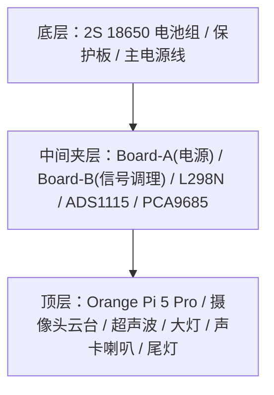

# 小橙硬件清单与接线文档

> 本文是物理层唯一信息源，只记录实物、供电、物理接线和已经占用的预留。
> 软件阶段与完成进度见 [roadmap.md](roadmap.md)，踩坑与 workaround 见
> [decisions.md](decisions.md) 的 ISS 区。

---

## 当前装配基线（2026-07-30）

- 当前持续接通的链路只有：电池组 → 保护板 → LM2596S #1 → Orange Pi。
- OV13855 MIPI 与 OV5640 USB 已分别调通；当前后端仍是单活动流，双流整合见 roadmap。
- L298N 与四个电机曾验证可用，但现已拆线，必须重新接线并回归方向/PWM/刹车。
- ADS1115、外设 5V 轨、云台、超声波、灯光和音频均按“当前未接或待重接”处理，不能以历史验证代替本次验收。

---

## 0. 硬件清单总览（零件册）

> 全车硬件的「是什么 / 干什么 / 怎么供电 / 接到哪 / 状态」速查索引。
> 引脚/接线细节以下方各节为准，本表只做总览。
> 状态：🔌 当前接通 ｜ ✅ 曾独立验证 ｜ 📋 当前待接/待重接 ｜ 🔒 仅预留

### 0.1 核心控制 & 电源

| # | 硬件 | 作用 | 供电 | 连接到哪 | 状态 |
|---|---|---|---|---|---|
| 1 | Orange Pi 5 Pro | 主控大脑(后端/视觉/NPU) | LM2596S#1 → 5V Type-C | 40-pin 外设信号当前均未接 | 🔌✅ |
| 2 | EVE 18650 ×2 (2S1P) | 全车动力源 7.4V(满8.4/截止6.0) | — | 经保护板 → 主电源轨 | 🔌✅ |
| 3 | 18650 3A 过充保护板 | 电池过充/过放/过流保护 | 串在电池组 | 电池 ↔ 主电源轨 | 🔌✅ |
| 4 | LM2596S #1 | 降压→5V，**专供 OPi**(干净轨) | 电池原始轨 | 输出→KF301端子→OPi | 🔌✅ |
| 5 | LM2596S #2 | 降压→5V，**专供外设轨** | 电池原始轨 | →PCA9685 V+/灯带/74AHCT125 | ✅ / 📋待重接 |

### 0.2 运动 & 传感

| # | 硬件 | 作用 | 供电 | 连接到哪 | 状态 |
|---|---|---|---|---|---|
| 6 | L298N 电机驱动 | 驱动左右电机(差速) | 电池原始轨(VMS) | ENA=7,IN1=11,IN2=13 / ENB=32,IN3=22,IN4=26 | ✅ / 📋待重接 |
| 7 | 黄色减速电机 ×4 | 四驱轮子 | L298N 输出 | 左右各并联 | ✅ / 📋待重接 |
| 8 | ZY-ADS1115 (ADC) | 读电池电压(安全告警) | OPi 3.3V (Pin1) | I2C 0x48，SDA=3/SCL=5；A0经20K/10K分压 | ✅ / 📋待重接 |
| 9 | HC-SR04 ×2 | 前/后超声波测距 | OPi 3.3V（RCWL-9200 宽压版） | 前：Trig 29/Echo 31；后：Trig 35/Echo 37；Echo 直连 | 📋 |

### 0.3 视觉 & 云台（双摄双云台）

| # | 硬件 | 作用 | 安装位 | 连接到哪 | 状态 |
|---|---|---|---|---|---|
| 10 | **OV13855 (1300万)** | **前置**主摄(FPV/视觉主力) | 前云台 | MIPI → RKISP 成像节点 | ✅ 已单独调通 |
| 11 | **OV5640 (500万)** | **后置**摄像头(倒车/后视) | 后云台 | USB UVC 成像节点 | ✅ 已单独调通 |
| 12 | PCA9685A | 16路PWM驱动舵机(不占40pin) | Board-B旁立柱 | I2C 0x40，SDA=3/SCL=5；V+走#2轨 | 📋 |
| 13 | 前云台 SG90 ×2 | 前摄 pan/tilt | 车头 | PCA9685 CH0=Pan / CH1=Tilt | 📋 |
| 14 | 后云台 SG90 ×2 | 后摄 pan/tilt | 车尾 | PCA9685 CH3=Pan / CH4=Tilt | 📋 |
| (15)| 前超声波扫描舵机 | (可选)前超声波摆扫 | 车头 | PCA9685 CH2 | 📋 |

> 双云台最多 4 个舵机；PCA9685 16 路足够，通道分配见上。

### 0.4 灯光 & 声音

| # | 硬件 | 作用 | 供电 | 连接到哪 | 状态 |
|---|---|---|---|---|---|
| 16 | **3W LED 大灯 ×2(自带驱动)** | 前照灯(PWM调光) | 正极→电池轨 | **信号→Pin33 直接接**(逻辑/PWM输入)；负极→共地 | 📋 |
| 17 | WS2812B RGB 灯带 | 尾灯/氛围灯(10灯珠) | LM2596S#2 5V独立 | DATA=Pin19→74AHCT125升压→DIN | 📋 |
| 18 | 74AHCT125 | 电平转换 3.3V→5V(灯带信号) | #2轨 5V | Board-B 上 | 📋 |
| 19 | USB 声卡(免驱) | 音频输出 | OPi USB | 后侧 USB 口 | ✅ / 📋待重接 |
| 20 | 8Ω 2W 小喇叭 | 鸣笛/语音/提示音 | USB声卡功放 | 接声卡输出 | ✅ / 📋待重接 |

> ⚠️ **大灯自带驱动模块**，信号脚为 3.3V 逻辑/PWM 输入，可直连 Pin 33；
> 原计划的外置 MOS 模块已取消并收为备件。

### 0.5 接插件 & 万能板

| # | 硬件 | 作用 | 用在哪 |
|---|---|---|---|
| 21 | 万能板(洞洞板) ×2 | Board-A配电汇流 / Board-B信号调理 | A:配电+共地星点；B:分压+电平转换+I2C扇出 |
| 22 | KF301-2P/3P 接线端子 | 免焊可拆螺丝端子 | 2P 用于电源回路，3P 用于 5V/GND/信号抽头 |
| 23 | 排针 | 模块间杜邦线插拔接口 | 万能板上做插拔，避免死焊 |

### 0.6 带外电源管理预留（暂不接）

| # | 硬件 | 作用 | 状态 |
|---|---|---|---|
| 24 | ESP32-C3 | 带外电源管家(优雅关机/唤醒) | 🔒预留 Pin16/18 |
| 25 | AMS1117-3.3 | 给 ESP32 常供 3.3V | 🔒预留焊位 |

---

## 1. 开发板基本信息

- **型号**：Orange Pi 5 Pro
- **SoC**：Rockchip RK3588S（8核，6TOPS NPU）
- **GPIO 库**：wiringOP-Python
- **40-pin IO 电压**：全部 3.3V

本文中的 `Pin` 一律表示 **40-pin 物理脚号**；代码中的 GPIO 参数使用 **wPi
编号**。两者不得混用，项目实际占用关系以第 4 节为准。完整板卡 pinout 使用
Orange Pi 官方资料查询，不在项目文档中复制维护。

---

## 2. 目标机械层级与走线原则

重新装车时按三层区域组织：



| 层级 | 固定布局 | 走线重点 |
|---|---|---|
| 底层 | 电池组和保护板 | BAT+/GND 上引到中间层，电机电源线尽量短且粗 |
| 中间夹层 | L298N 居中偏前；左侧 Board-A（电源）；右侧 Board-B（信号调理）+ ADS1115 + PCA9685 | 电源相关集中左侧，I2C/信号设备集中右侧，减少交叉线 |
| 顶层 | OPi 5 Pro 居中架高；40pin 朝左；USB 朝后 | 40pin 线束从左侧下到中间层；USB 声卡插后侧；前端留给云台/摄像头/超声波/大灯 |

**固定方向约定：**
- 车头 = 前云台 + OV13855 + 前 HC-SR04 + 双大灯所在方向
- 车尾 = 后云台 + OV5640 + 后 HC-SR04 + WS2812B 灯带所在方向
- OPi 40pin 排针朝左，便于接中间层控制线和 I2C 线
- OPi 用铜柱架高，底部保留散热和理线空间

**线束原则：**
- 电源线（BAT+、5V、GND、电机线）与信号线分侧走，交叉时尽量垂直交叉
- I2C 只从 OPi 引出一组 SDA/SCL 到 Board-B，再分给 ADS1115 和 PCA9685
- 共地必须可靠：电池 GND、L298N、LM2596S×2、大灯驱动、ADS1115、PCA9685、OPi 必须同地，统一汇到 Board-A 的共地星点
- **Board-A 上 LM2596S#1 输出侧接 KF301-2P 端子，不焊死**，保留带外电源管理高边开关的插入位置

---

## 3. 目标电源拓扑（当前仅 #1 → OPi 分支接通）

```
EVE 18650 × 2（2S1P）
  │
  ├─ 原始电池输出（7.4V 标称，8.4V 满电，6.0V 截止）
  │     │
  │     ├─ L298N VCC/VMS（电机驱动电源，直接接电池）
  │     ├─ ADS1115 分压采样输入（20KΩ + 10KΩ）
  │     ├─ 大灯供电（3W LED×2，自带驱动，正极走电池轨，信号直连 Pin33）
  │     └─ [预留] AMS1117-3.3 输入（电池→AMS1117→3.3V→ESP32-C3 常供）
  │
  └─ Board-A：双 LM2596S 降压
        │
        ├─ LM2596S #1（专供 OPi，独立干净轨）
        │     输出：5.0V
        │     → [KF301-2P 端子，不焊死] → OPi 5 Pro（5V Type-C）
        │     ⚠️ 端子中间预留带外电源管理高边开关接入点
        │
        └─ LM2596S #2（专供 5V 外设轨）
              输出：5.0V
              ├─ PCA9685 V+（舵机电源）
              ├─ WS2812B（独立 5V 供电）
              └─ 74AHCT125（VCC）

所有模块共用电池 GND（共地），统一汇到 Board-A 共地星点。
```

**双 LM2596S 分轨理由：** OPi 在视觉推理时存在明显负载峰值；舵机、灯带等外设也会产生电流尖峰。两者共用降压模块容易造成 OPi 掉电重启，因此主控和 5V 外设必须分轨。

**关键风险：** LM2596S 需要约 7V 输入才能稳定输出 5V，电池接近该电压时两路输出都会失稳。ADS1115 电压监控因此是安全必选项，见 ADR-006。

**上电顺序：**
1. 先分别调好两块 LM2596S 输出（万用表确认 5.0V ± 0.1V，空载状态下调）
2. #1 接 OPi Type-C，#2 接外设

---

## 4. 40-pin 引脚唯一分配表

> 全项目唯一引脚注册表。新增外设使用引脚前必须在此确认无冲突，再接线。

| 物理脚 | wPi | 信号名 | 用途 | 状态 |
|---|---:|---|---|---|
| 1 | — | 3.3V | ADS1115/PCA9685 逻辑电源；HC-SR04 VCC | 📋 |
| 3 | 0 | SDA.1 | I2C1_M4 SDA（ADS1115 + PCA9685） | 📋 |
| 5 | 1 | SCL.1 | I2C1_M4 SCL（ADS1115 + PCA9685） | 📋 |
| 6 | — | GND | I2C 设备共地 | 📋 |
| 7 | 2 | PWM13_M2 | 左电机 ENA（PWM 调速） | 📋待重接 |
| 11 | 5 | CAN1_RX(GPIO) | 左电机 IN1（方向 A） | 📋待重接 |
| 13 | 7 | CAN1_TX(GPIO) | 左电机 IN2（方向 B） | 📋待重接 |
| 16 | 9 | TXD.6 | ESP32 UART RX（OPi→ESP32） | 🔒 |
| 18 | 10 | RXD.6 | ESP32 UART TX（ESP32→OPi） | 🔒 |
| 19 | 11 | SPI0_TXD(MOSI) | WS2812B DATA，经 74AHCT125 升至 5V | 📋 |
| 22 | 13 | GPIO1_B0 | 右电机 IN3（方向 A） | 📋待重接 |
| 26 | 16 | SPI0_CS1(GPIO) | 右电机 IN4（方向 B） | 📋待重接 |
| 29 | 19 | GPIO1_A4 | 前超声波 Trig | 📋 |
| 31 | 20 | GPIO1_A6 | 前超声波 Echo；3.3V 供电，直连 | 📋 |
| 32 | 21 | PWM14_M2 | 右电机 ENB（PWM 调速） | 📋待重接 |
| 33 | 22 | PWM15_M2 | 大灯自带驱动 SIG，PWM 调光 | 📋 |
| 35 | 23 | GPIO4_A7 | 后超声波 Trig | 📋 |
| 37 | 25 | GPIO4_A6 | 后超声波 Echo；3.3V 供电，直连 | 📋 |

**空闲脚（可用）：** 8/10(TXD.2/RXD.2)、12、15、21、23/24(SPI0)、27/28(SDA.4/SCL.4)、36/38/40
**PCA9685 通道预留：** CH0/1 = 前云台 Pan/Tilt，CH2 = 可选前超声波扫描，CH3/4 = 后云台 Pan/Tilt；均不占 40-pin。

---

## 5. 电机驱动（L298N）引脚映射

| 信号 | L298N 端子 | OPi 物理引脚 | wPi 编号 | sysfs 路径 | 备注 |
|---|---|---|---|---|---|
| ENA（左 PWM） | ENA | 7 | 2 | `/sys/class/pwm/pwmchip2/pwm0` | PWM13_M2，febf0010.pwm |
| IN1（左方向A） | IN1 | 11 | 5 | GPIO | — |
| IN2（左方向B） | IN2 | 13 | 7 | GPIO | — |
| ENB（右 PWM） | ENB | 32 | 21 | `/sys/class/pwm/pwmchip3/pwm0` | PWM14_M2，febf0020.pwm |
| IN3（右方向A） | IN3 | 22 | 13 | GPIO | — |
| IN4（右方向B） | IN4 | 26 | 16 | GPIO | — |
| GND | GND | 任意 GND pin | — | — | 共地！ |

**PWM 历史实测基线（重接后复验）：**
- Period：1,000,000 ns（1kHz）
- 极性：`inversed`（`PWM_INVERTED = True`），RK3588S 实测极性反转
- 死区：40%（低于此占空比电机不转）

**orangepi-config 中需启用的 overlay：**
- `pwm13-m2`
- `pwm14-m2`

---

## 6. I2C 总线与 ADS1115 电池电压监控

I2C 设备集中在 Board-B（中间层右侧），ADS1115 与 PCA9685 共用 OPi 的 I2C1_M4：

| 设备 | 默认地址 | 用途 | 位置 |
|---|---|---|---|
| ADS1115 | `0x48` | 电池电压采样 | Board-B |
| PCA9685 | `0x40` | SG90 云台舵机 PWM | Board-B 旁立柱架 |

| I2C 信号 | OPi 物理引脚 | 连接方式 |
|---|---|---|
| SDA | 3（SDA.1） | 一根主线下引到 Board-B，再分到 ADS1115/PCA9685 |
| SCL | 5（SCL.1） | 一根主线下引到 Board-B，再分到 ADS1115/PCA9685 |
| 3.3V | 1（3.3V） | 给 ADS1115 VDD、PCA9685 VCC 逻辑供电 |
| GND | 6 或 9（GND） | 接 Board-A 共地星点 |

**分压电路历史实测基线（重接后复验）：**
```
电池正极
    │
   20KΩ（上分压电阻）
    │
    ├─── → ADS1115 A0（测量点）
    │
   10KΩ（下分压电阻）
    │
   GND

分压比：10K / (20K + 10K) = 1/3（理论值）
代码使用万用表校准后的倍率 `3.026`
满电 8.4V → ADC测 2.8V；截止 6.0V → ADC测 2.0V
```

**验证命令：**
```bash
i2cdetect -y 1
# ADS1115 应在 0x48；PCA9685 接入后应在 0x40
```

---

## 7. 万能板规划

使用 2 块 7×9 万能板（剩余备用），外加成品模块立柱架设：

### Board-A｜电源 + 共地星点（中间层左）

- 2× LM2596S（#1 专供 OPi，#2 专供 5V 外设轨）
- 三条汇流：电池原始轨 / 5V 外设轨 / **全车唯一共地星点**
- KF301-2P：电池进线 / 各外设 5V-GND 抽头 / **LM2596S#1 输出侧（不焊死，预留高边开关插入位）**
- [预留] AMS1117-3.3 焊位（电池→AMS1117→3.3V→ESP32 常供），当前留空不焊

### Board-B｜信号调理 + I2C 汇集（中间层右）

- 74AHCT125 电平转换（SPI0 MOSI 3.3V → WS2812B DATA 5V）
- I2C 从 OPi 单组进，板上扇出给 ADS1115 和 PCA9685
- ADS1115 已焊在旁边，PCA9685 成品模块立柱架在 Board-B 右侧
- HC-SR04 使用 RCWL-9200 宽压版并由 3.3V 供电，Echo 分压电阻不安装

### 成品模块（立柱架，不占万能板）

- PCA9685：I2C 从 Board-B 取，逻辑 VCC 接 3.3V，舵机 V+ 接 #2 外设轨
- 大灯不经过 PCA9685 或外置 MOS 模块；两颗灯的正、负、SIG 分别并联，SIG 接 Pin 33

---

## 8. 待接与预留约束

- 前置 OV13855 固定在前云台；后置 OV5640 固定在后云台。
- SG90 只由 PCA9685 驱动，舵机 V+ 走 LM2596S #2，不能从 OPi 3.3V 取电。
- RCWL-9200 版 HC-SR04 必须由 3.3V 供电后再直连 Echo；若更换为 5V 老款，必须重新加入分压。
- WS2812B DATA 固定走 Pin 19，并通过 74AHCT125 做 3.3V→5V 电平转换；供电走 #2 外设轨。实测 3.3V 直连会导致首颗灯珠错色，不能省略电平转换；验证脚本见 [python_test/test_strip.py](../python_test/test_strip.py)。
- ESP32-C3 当前只占用 Pin 16/18、AMS1117 焊位和 LM2596S #1 输出端子预留，不接线、不供电。

接入任何待接设备前，先核对本节与第 4 节，再同步 `app/config.py`。阶段安排只在
[roadmap.md](roadmap.md) 维护；硬件踩坑及 workaround 只在
[decisions.md](decisions.md) 的 ISS 区维护。
